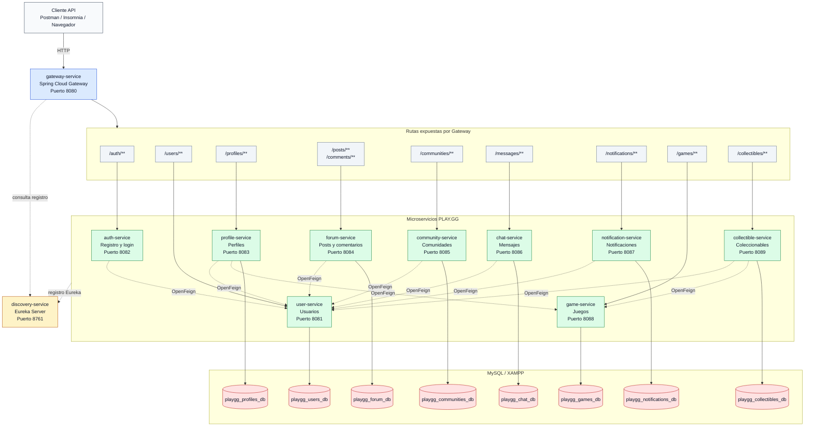

# Diagrama de arquitectura de microservicios PLAY.GG

Este diagrama muestra la arquitectura general del proyecto: cliente, API Gateway, Eureka, microservicios de dominio, comunicacion interna con OpenFeign y bases de datos MySQL por servicio.

## Lectura rapida

- El cliente consume la API por `gateway-service` en `http://localhost:8080`.
- `gateway-service` enruta por path hacia cada microservicio usando los nombres registrados en Eureka.
- `discovery-service` mantiene el registro de servicios disponibles.
- Cada microservicio de dominio administra su propia base de datos MySQL.
- Las validaciones entre servicios se hacen con OpenFeign, principalmente hacia `user-service` y `game-service`.
- `auth-service` no tiene base de datos propia en esta version; usa `user-service` para registrar y validar usuarios.
