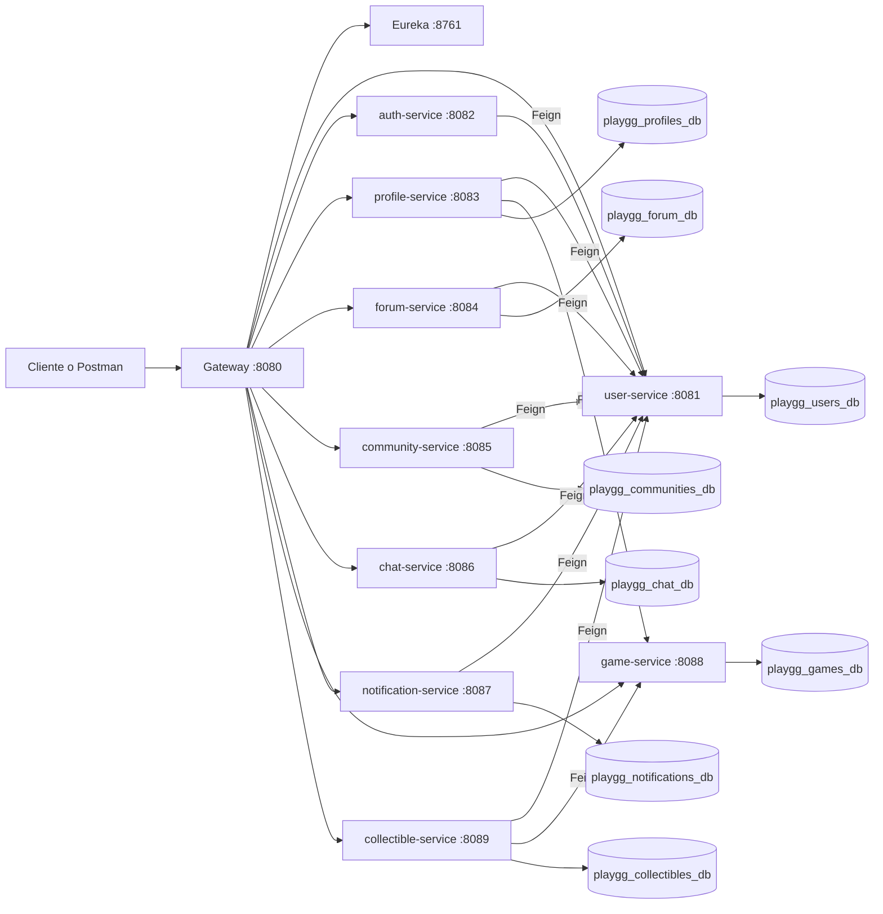

# PLAY.GG Microservices .

PLAY.GG es una plataforma gamer/social construida como proyecto universitario de microservicios con Spring Boot. La idea es separar responsabilidades por dominio: usuarios, autenticacion, perfiles, foro, comunidades, chat, notificaciones, juegos y coleccionables.

El objetivo de esta version es ser clara. No usa tecnologias de infraestructura avanzada.

## Arquitectura general

El proyecto usa Maven Multi-Module. El `pom.xml` padre centraliza Java 17, Spring Boot 3 y Spring Cloud para que todos los servicios trabajen con versiones coherentes.

El diagrama completo de arquitectura esta en [`DIAGRAMA_ARQUITECTURA_MICROSERVICIOS.md`](DIAGRAMA_ARQUITECTURA_MICROSERVICIOS.md).

Cada microservicio de dominio sigue una arquitectura CSR simple:

```text
controller -> service -> repository
```

- `controller`: recibe peticiones HTTP y valida DTOs de entrada.
- `service`: contiene reglas de negocio, validaciones y conversion entre entidades y DTOs.
- `repository`: accede a MySQL mediante Spring Data JPA.
- `model`: define entidades JPA propias del microservicio.
- `dto`: define datos de entrada y salida sin exponer directamente las entidades.
- `exception`: centraliza errores comunes de la API.
- `client`: aparece solo en servicios que consultan otro microservicio con OpenFeign.
- `config`: aparece solo cuando el servicio necesita configuracion real, como seguridad en `auth-service`.

## Microservicios

| Servicio | Puerto | Responsabilidad principal |
| --- | ---: | --- |
| `discovery-service` | 8761 | Registro Eureka de servicios |
| `gateway-service` | 8080 | Entrada unica a la API usando Spring Cloud Gateway |
| `user-service` | 8081 | Usuarios, datos de cuenta y datos internos para autenticacion |
| `auth-service` | 8082 | Registro y login basico consultando `user-service` |
| `profile-service` | 8083 | Perfil gamer/social del usuario |
| `forum-service` | 8084 | Posts y comentarios |
| `community-service` | 8085 | Comunidades y miembros |
| `chat-service` | 8086 | Mensajes privados simples |
| `notification-service` | 8087 | Notificaciones de usuario |
| `game-service` | 8088 | Catalogo de juegos |
| `collectible-service` | 8089 | Logros, trofeos o coleccionables |

El modulo de busquedas fue retirado para mantener la arquitectura mas simple y enfocada en los dominios principales del sistema.

## Comunicacion entre servicios

La comunicacion se mantiene reducida. Los servicios no se conectan todos contra todos.

| Servicio origen | Consulta permitida |
| --- | --- |
| `auth-service` | `user-service` |
| `profile-service` | `user-service`, `game-service` |
| `forum-service` | `user-service` |
| `community-service` | `user-service` |
| `chat-service` | `user-service` |
| `notification-service` | `user-service` |
| `collectible-service` | `user-service`, `game-service` |

Los microservicios no tienen relaciones JPA entre bases distintas. Por ejemplo, un post guarda `userId`, un perfil guarda `userId` y `favoriteGameId`, y un coleccionable guarda `userId` y `gameId`. Si se necesita comprobar que esos ids existen, se consulta al servicio correspondiente mediante Feign.

Las relaciones JPA se usan solo dentro del mismo microservicio. Ejemplos:

- `Post -> Comment` dentro de `forum-service`.
- `Community -> CommunityMember` dentro de `community-service`.

## Tecnologias utilizadas

- Java 17
- Spring Boot 3
- Spring Cloud
- Eureka Discovery Server
- Spring Cloud Gateway
- OpenFeign
- Spring Security en `auth-service`
- Spring Data JPA / Hibernate
- MySQL
- Bean Validation
- Lombok
- Maven Multi-Module

## Eureka y Gateway

Eureka funciona como registro de servicios. Cada microservicio se registra con su nombre, por ejemplo `user-service` o `forum-service`. Esto permite que otros servicios los encuentren por nombre sin depender de una URL fija.

Gateway es la puerta de entrada de la API. En vez de llamar directamente a cada puerto, el cliente puede entrar por `http://localhost:8080` y Gateway redirige al microservicio correcto usando Eureka.

## Feign

OpenFeign permite declarar clientes HTTP con interfaces Java. En este proyecto se usa para consultas simples entre servicios, principalmente para validar que un `userId` o `gameId` exista.

Ejemplo conceptual:

```java
@FeignClient(name = "user-service")
public interface UserClient {
  @GetMapping("/users/{id}")
  ResponseEntity<Object> findById(@PathVariable Long id);
}
```

Feign se usa solo donde aporta claridad. Los servicios que no consultan otros microservicios no tienen dependencia de OpenFeign.

## Autenticacion basica

`auth-service` permite registrar usuarios e iniciar sesion de forma simple. No guarda sesiones propias: consulta a `user-service` mediante Feign, valida credenciales y devuelve datos basicos del usuario.

Esta implementacion separa autenticacion y usuarios sin agregar OAuth ni manejo avanzado de sesiones.

## Bases de datos

Cada microservicio de dominio usa su propia base de datos MySQL. Con XAMPP se puede iniciar MySQL/MariaDB y crear las bases desde phpMyAdmin, o dejar que Spring las cree si el usuario tiene permisos.

```sql
CREATE DATABASE IF NOT EXISTS playgg_users_db;
CREATE DATABASE IF NOT EXISTS playgg_profiles_db;
CREATE DATABASE IF NOT EXISTS playgg_forum_db;
CREATE DATABASE IF NOT EXISTS playgg_communities_db;
CREATE DATABASE IF NOT EXISTS playgg_chat_db;
CREATE DATABASE IF NOT EXISTS playgg_notifications_db;
CREATE DATABASE IF NOT EXISTS playgg_games_db;
CREATE DATABASE IF NOT EXISTS playgg_collectibles_db;
```

Si tu MySQL usa password, ajusta `spring.datasource.password` en el `application.yml` de cada servicio.

## Estructura del proyecto

```text
PLAY.GG/
|-- pom.xml
|-- discovery-service/
|-- gateway-service/
|-- user-service/
|-- auth-service/
|-- profile-service/
|-- forum-service/
|-- community-service/
|-- chat-service/
|-- notification-service/
|-- game-service/
|-- collectible-service/
```

Estructura base de un microservicio de dominio:

```text
src/main/java/com/playgg/[servicio]/
|-- controller
|-- service
|-- repository
|-- model
|-- dto
|-- exception
|-- client     # solo si consume otro servicio con Feign
|-- config     # solo si necesita configuracion propia
```

## Como ejecutar

1. Iniciar MySQL desde XAMPP.
2. Verificar usuario y password en los `application.yml`.
3. Levantar primero Eureka:

```bash
mvn -pl discovery-service spring-boot:run
```

4. Levantar Gateway:

```bash
mvn -pl gateway-service spring-boot:run
```

5. Levantar los servicios de dominio que se quieran probar. Para una presentacion completa, este orden es el mas comodo:

```bash
mvn -pl user-service spring-boot:run
mvn -pl auth-service spring-boot:run
mvn -pl game-service spring-boot:run
mvn -pl profile-service spring-boot:run
mvn -pl forum-service spring-boot:run
mvn -pl community-service spring-boot:run
mvn -pl chat-service spring-boot:run
mvn -pl notification-service spring-boot:run
mvn -pl collectible-service spring-boot:run
```

6. Abrir Eureka en `http://localhost:8761` y confirmar que los servicios aparezcan registrados.

7. Probar la API desde el Gateway en `http://localhost:8080`. Por ejemplo, `POST http://localhost:8080/auth/register` o `GET http://localhost:8080/users`.

No es necesario compilar manualmente antes de levantar los servicios. Al ejecutar cada servicio con `spring-boot:run`, Maven compila lo necesario automaticamente.

## Pruebas Unitarias

Todos los modulos heredan `spring-boot-starter-test` desde el POM padre, por lo que el proyecto usa JUnit 5 y Mockito sin agregar dependencias innecesarias.

JUnit 5 se usa como framework de pruebas. Mockito se usa para crear mocks, que son objetos simulados que reemplazan dependencias reales durante el test. Por ejemplo, un `Service` puede probarse usando un `Repository` mockeado, sin conectarse a MySQL. En una arquitectura de microservicios esto es importante porque permite validar la logica de negocio sin levantar otros servicios ni hacer llamadas HTTP reales.

Las pruebas unitarias se encuentran en `src/test/java`, manteniendo el mismo package de `src/main/java`. No usan `@SpringBootTest`; trabajan con `@ExtendWith(MockitoExtension.class)`, `@Mock`, `@InjectMocks`, `when(...)`, `verify(...)`, `assertEquals`, `assertThrows` y `assertNotNull`.

Clases con pruebas unitarias:

- `auth-service`: `AuthServiceTest`
- `user-service`: `UserServiceTest`
- `profile-service`: `ProfileServiceTest`
- `forum-service`: `PostServiceTest` y `CommentServiceTest`
- `community-service`: `CommunityServiceTest`
- `chat-service`: `MessageServiceTest`
- `notification-service`: `NotificationServiceTest`
- `game-service`: `GameServiceTest`
- `collectible-service`: `CollectibleServiceTest`

Las pruebas cubren casos principales de crear, buscar, actualizar, eliminar y manejo de errores donde corresponde. Tambien verifican que los clientes Feign se usen como mocks, evitando llamadas reales entre microservicios.

Lo que falta:

- `discovery-service` no tiene pruebas unitarias de Service porque funciona como servidor Eureka y no posee CRUD de negocio.
- `gateway-service` no tiene pruebas unitarias de Service porque su responsabilidad principal es enrutar peticiones con Spring Cloud Gateway.
- Si mas adelante se agregan reglas propias en esos modulos, se pueden crear pruebas unitarias para esas clases.

Para ejecutar todos los tests del proyecto:

```bash
mvn test
```

Tambien se puede ejecutar un modulo especifico:

```bash
mvn -pl user-service test
```

## Guia rapida para presentacion

Para mostrar el flujo de datos de forma clara, conviene ingresar datos por Postman o Insomnia usando siempre el Gateway (`localhost:8080`). El Gateway redirige al microservicio correcto y cada microservicio guarda sus propios datos en su base MySQL.

| Paso | Peticion | Servicio que responde | Donde se guarda |
| --- | --- | --- | --- |
| 1 | `POST /auth/register` | `auth-service` crea el usuario usando `user-service` por Feign | `playgg_users_db.users` |
| 2 | `POST /auth/login` | `auth-service` valida credenciales consultando `user-service` | No guarda datos propios |
| 3 | `POST /games` | `game-service` | `playgg_games_db.games` |
| 4 | `POST /profiles` | `profile-service` valida `userId` y `favoriteGameId` por Feign | `playgg_profiles_db.profiles` |
| 5 | `POST /posts` | `forum-service` valida `userId` por Feign | `playgg_forum_db.posts` |
| 6 | `POST /comments` | `forum-service` valida `postId` local y `userId` por Feign | `playgg_forum_db.comments` |
| 7 | `POST /communities` | `community-service` valida `ownerId` por Feign | `playgg_communities_db.communities` |
| 8 | `POST /messages` | `chat-service` valida emisor y receptor por Feign | `playgg_chat_db.messages` |
| 9 | `POST /notifications` | `notification-service` valida `userId` por Feign | `playgg_notifications_db.notifications` |
| 10 | `POST /collectibles` | `collectible-service` valida `userId` y `gameId` por Feign | `playgg_collectibles_db.collectibles` |

Ejemplo de registro:

```json
{
  "nickname": "playerOne",
  "firstName": "Juan",
  "lastName": "Perez",
  "email": "juan@mail.com",
  "password": "12345678",
  "country": "Chile"
}
```

Ejemplo de juego:

```json
{
  "title": "Valorant",
  "genre": "Shooter",
  "platform": "PC",
  "multiplayer": true,
  "competitive": true,
  "imageUrl": "https://example.com/valorant.jpg"
}
```

Ejemplo de perfil, asumiendo `userId = 1` y `gameId = 1`:

```json
{
  "userId": 1,
  "avatarUrl": "https://example.com/avatar.png",
  "bannerUrl": "https://example.com/banner.png",
  "bio": "Jugador competitivo de FPS",
  "steamUsername": "playerOneSteam",
  "discordUsername": "playerOne#1234",
  "favoriteGameId": 1,
  "rank": "Gold",
  "level": 12
}
```

## Ejemplos JSON por microservicio

Los campos que terminan en `Id` deben existir antes de enviar la peticion. Por ejemplo, para crear un perfil primero debe existir el usuario (`userId`) y, si se informa juego favorito, tambien debe existir el juego (`favoriteGameId`).

### auth-service

Registro por `POST /auth/register`:

```json
{
  "nickname": "playerOne",
  "firstName": "Juan",
  "lastName": "Perez",
  "email": "juan@mail.com",
  "password": "12345678",
  "country": "Chile"
}
```

Login por `POST /auth/login`:

```json
{
  "email": "juan@mail.com",
  "password": "12345678"
}
```

### user-service

Crear usuario por `POST /users`:

```json
{
  "nickname": "playerTwo",
  "firstName": "Maria",
  "lastName": "Lopez",
  "email": "maria@mail.com",
  "password": "12345678",
  "country": "Chile",
  "role": "PLAYER",
  "active": true
}
```

Roles validos: `PLAYER`, `ADMIN`.

### game-service

Crear juego por `POST /games`:

```json
{
  "title": "Valorant",
  "genre": "Shooter",
  "platform": "PC",
  "multiplayer": true,
  "competitive": true,
  "imageUrl": "https://example.com/valorant.jpg"
}
```

### profile-service

Crear perfil por `POST /profiles`:

```json
{
  "userId": 1,
  "avatarUrl": "https://example.com/avatar.png",
  "bannerUrl": "https://example.com/banner.png",
  "bio": "Jugador competitivo de FPS",
  "steamUsername": "playerOneSteam",
  "discordUsername": "playerOne#1234",
  "favoriteGameId": 1,
  "rank": "Gold",
  "level": 12
}
```

`userId` debe existir en `user-service`. `favoriteGameId` es opcional, pero si se envia debe existir en `game-service`.

### forum-service

Crear post por `POST /posts`:

```json
{
  "userId": 1,
  "title": "Mejor agente para empezar",
  "content": "Estoy empezando en Valorant, que agente recomiendan?",
  "category": "Valorant"
}
```

Crear comentario por `POST /comments`:

```json
{
  "postId": 1,
  "userId": 1,
  "content": "Sage es buena opcion para aprender."
}
```

### community-service

Crear comunidad por `POST /communities`:

```json
{
  "ownerId": 1,
  "name": "Valorant Chile",
  "description": "Comunidad para buscar equipo y compartir partidas",
  "bannerUrl": "https://example.com/banner-valorant.jpg"
}
```

Agregar miembro por `POST /communities/{id}/members`:

```json
{
  "userId": 2,
  "role": "MEMBER"
}
```

Roles validos: `OWNER`, `MODERATOR`, `MEMBER`.

### chat-service

Crear mensaje por `POST /messages`:

```json
{
  "senderId": 1,
  "receiverId": 2,
  "content": "Hola, jugamos?",
  "read": false
}
```

`senderId` y `receiverId` deben existir en `user-service`.

### notification-service

Crear notificacion por `POST /notifications`:

```json
{
  "userId": 1,
  "title": "Nuevo comentario",
  "message": "Alguien comento tu publicacion",
  "type": "COMMENT",
  "read": false
}
```

Tipos validos: `MESSAGE`, `COMMENT`, `COMMUNITY_INVITE`, `FRIEND_REQUEST`.

### collectible-service

Crear coleccionable por `POST /collectibles`:

```json
{
  "userId": 1,
  "gameId": 1,
  "name": "Primera victoria",
  "description": "Ganaste tu primera partida competitiva",
  "rarity": "RARE"
}
```

Rarezas validas: `COMMON`, `RARE`, `EPIC`, `LEGENDARY`.

## Flujo de microservicios



Flujo general de ingreso o consulta:

```text
Cliente -> Gateway -> Controller -> Service -> Repository -> MySQL
```

Si el dato depende de otro microservicio, el `Service` valida primero por Feign. Ejemplo: `profile-service` recibe `userId` y `favoriteGameId`, consulta `user-service` y `game-service`, y solo despues guarda el perfil en su propia base de datos.

## Endpoints principales

- `POST /users`
- `GET /users`
- `GET /users/{id}`
- `GET /users/nickname/{nickname}`
- `GET /users/email/{email}`
- `GET /users/internal/auth/email/{email}`
- `POST /auth/register`
- `POST /auth/login`
- `POST /profiles`
- `POST /posts`
- `POST /comments`
- `POST /communities`
- `POST /communities/{id}/members`
- `POST /messages`
- `POST /notifications`
- `POST /games`
- `POST /collectibles`

## Ideas clave

- El sistema se divide por dominios para que cada servicio tenga una responsabilidad clara.
- Eureka permite descubrir servicios por nombre.
- Gateway centraliza el acceso externo.
- Controller, Service y Repository separan entrada HTTP, reglas de negocio y persistencia.
- Los DTOs evitan exponer entidades JPA directamente.
- Feign se usa solo para validar datos externos necesarios.
- No hay relaciones JPA entre microservicios; solo ids como `userId`, `gameId` o `postId`.
- Las relaciones JPA locales se mantienen donde ayudan a representar el dominio.
- La autenticacion se concentra en `auth-service`, por lo que la validacion de credenciales no queda repartida por todo el proyecto.
